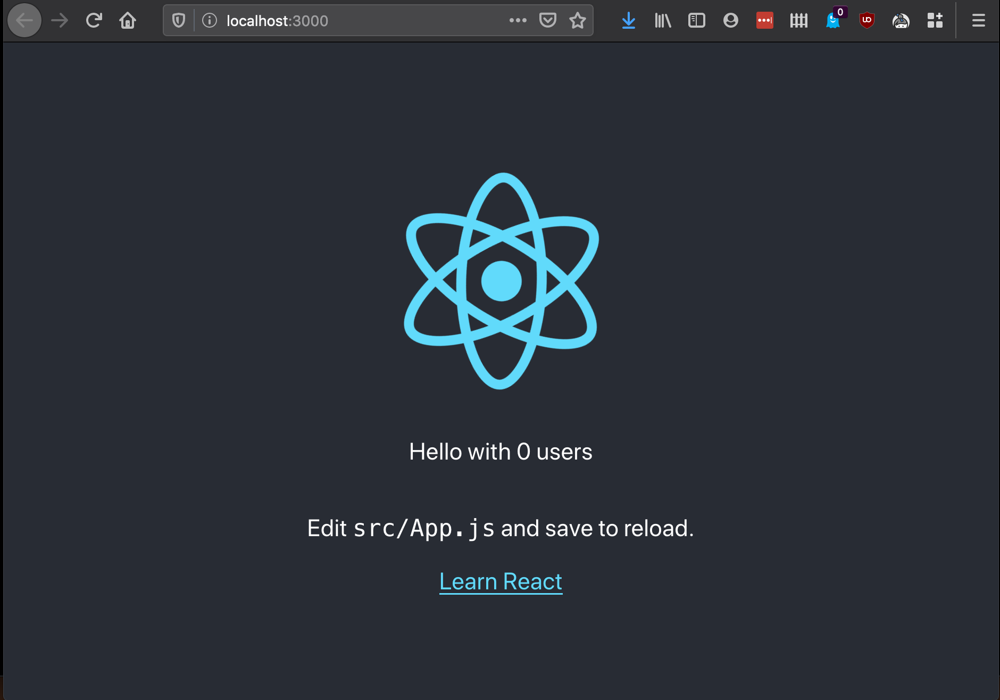

# 🐋 Exemplo do uso do Docker Compose com React/Rust/PostegreSQL

Repositório criado a partir de um Fork do repósitorio do Docker ([awesome-compose](https://github.com/docker/awesome-compose)), dando destaque ao exemplo do Docker Compose com uma aplicação em React, Rust e PostgreSQL

> ReadME inspirado no mesmo repositório e projeto do awesome-compose

## 🔨 Setup do Projeto

Primeiro confira que o Docker e o Docker Compose estão instalados:

-   Windows/macOS:
    [Docker Desktop](https://www.docker.com/get-started)
-   Linux: [Docker](https://www.docker.com/get-started) e
    [Docker Compose](https://github.com/docker/compose)

Depois, entre na pasta com o projeto (react-rust-postgres), lá você irá localizar o arquivo `compose.yaml`,
esse que contém as configurações necessárias para os containers e a aplicação em sí para assim executar o Docker Compose.
Asegurando que está na pasta correta, execute a seguinte linha de comando para subir a aplicação:

```console
docker compose up -d
```

Caso queira parar ela execute:

```console
docker compose down
```

## 🏆 Resultado esperado

Quando a aplicação for levantada, isso ocorrerá na porta 3000, então tenha certeza que ela estará livre para isso

Lista de containers que deverão estar disponíveis e ligados:

```console
$ docker ps
CONTAINER ID        IMAGE                          COMMAND                  CREATED             STATUS              PORTS                    NAMES
30b7d9dc4898        react-rust-postgres_backend    "cargo run --offline"    37 seconds ago      Up 35 seconds       8000/tcp                 react-rust-postgres_backend_1
0bca0cb682b8        react-rust-postgres_frontend   "docker-entrypoint.s…"   42 seconds ago      Up 41 seconds       0.0.0.0:3000->3000/tcp   react-rust-postgres_frontend_1
1611961bf3d1        postgres:12-alpine             "docker-entrypoint.s…"   42 seconds ago      Up 36 seconds       0.0.0.0:5432->5432/tcp   react-rust-postgres_db_1
```

Acesse `http://localhost:3000` para ver o resultado e a página web.



## 👥 Integrantes do Grupo

-   **_Cauê Luan Schimmock_**
-   **_Gabriela Giolo_**
-   **_Guilherme Camargo_**
-   **_Júlia Parizotto_**
-   **_Mathias Diehl_**
